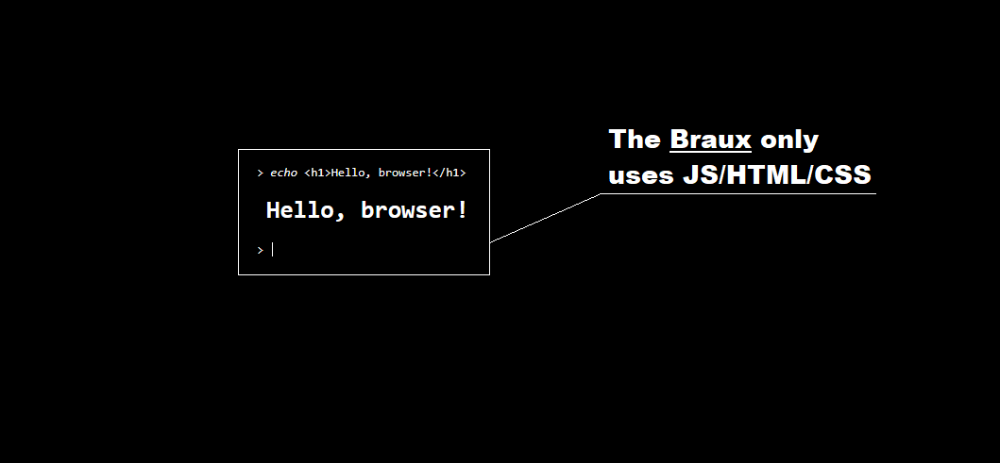

# What is Braux?
Braux is a unique console system built on browser-based client tools.
It combines ease of use with powerful features, giving you a Unix-like
command line with a choice of different themes and color schemes.

# Installed?
### https://dosx.su/terminal

# To do
* make command control the current user

